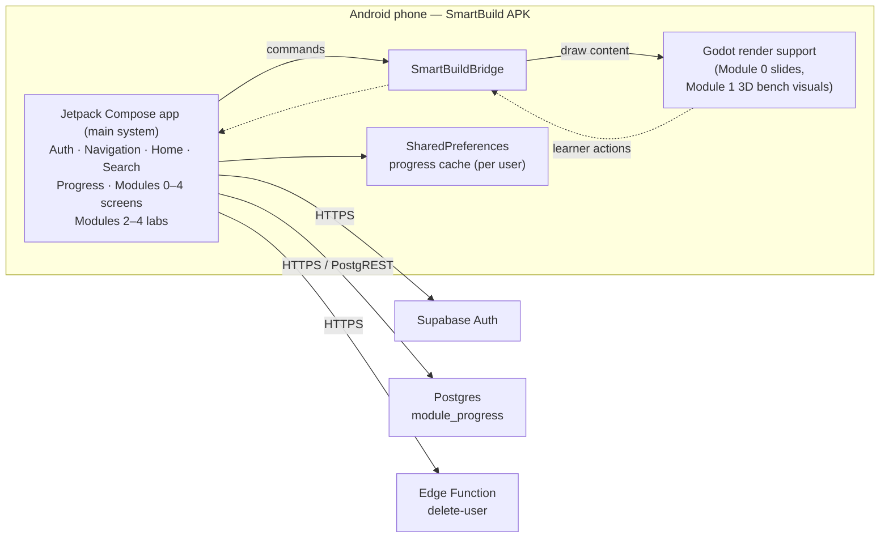
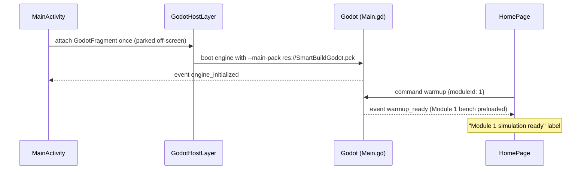
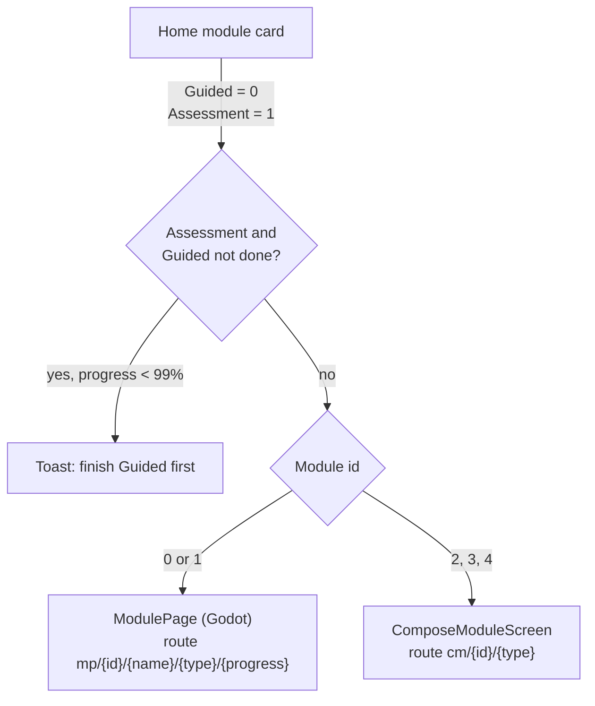
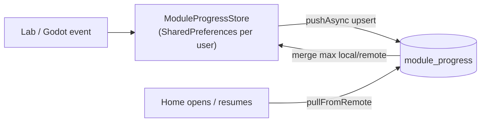

# SmartBuild — Architecture

This document explains how the system is put together. For build steps see
[SETUP_AND_BUILD](./SETUP_AND_BUILD.md); for code-level detail see
[ANDROID_APP](./ANDROID_APP.md) and [GODOT_PROJECT](./GODOT_PROJECT.md).

---

## 1. Big picture

SmartBuild is a **Kotlin / Jetpack Compose Android app**. Compose *is* the system: it owns
sign-in and accounts, navigation, Home, Component Search, every module screen, Guided vs
Assessment rules, unlocking, progress, cloud sync, error handling, and the hands-on labs for
**Modules 2–4**.

For the visual content of **Module 0** (intro slides) and **Module 1** (3D PC bench), Compose
uses an embedded **Godot 4.7** engine as a **supporting render component** — in the same way
an app uses a video player or a map view. Godot:

- is started, shown, hidden and stopped by Compose (`ModulePage`);
- only draws the content Compose asks for (`prepare`) and reports what the learner did;
- has **no** accounts, navigation, database access, progress storage or unlock logic of its
  own — Compose decides what every report means.

Godot's content ships inside the APK as `assets/SmartBuildGodot.pck`.

The only backend is **Supabase** (hosted), and only Compose talks to it: Auth for accounts,
one Postgres table for progress, and one Edge Function for account deletion. There is no
custom server.



### Module screens

Every module is opened, controlled and closed by a Compose screen. Modules 0 and 1 use Godot
only as a supporting surface for their visuals.

| Module | Title | Compose screen | Godot support content |
|---|---|---|---|
| 0 | Introduction to Computer Systems Servicing | `ModulePage` | Slide visuals (`modules/module_0/Main.tscn`, 21 slides) |
| 1 | Installing and Configuring Computer Systems | `ModulePage` | 3D bench and page visuals (`modules/module_1/Main.tscn` → `ModuleShell` + `PcBuildBench`) |
| 2 | Setting Up Computer Networks | `ComposeModuleScreen` → cable intro, crimp lab, topology | — |
| 3 | Setting Up Computer Servers | `ComposeModuleScreen` → server topology, file-server desktop | — |
| 4 | Maintaining Computer Systems and Networks | `ComposeModuleScreen` → Windows service-ticket desktop | — |

Early prototypes of Modules 2–4 in Godot were replaced by native Compose labs and removed from
the Godot project; Godot replies with an `error` event if asked to show them.

---

## 2. Tech stack

| Layer | Technology | Version |
|---|---|---|
| Language (app) | Kotlin | 2.4.10 |
| UI | Jetpack Compose (BOM), Material 3 | BOM 2026.06.01 |
| Navigation | `androidx.navigation:navigation-compose` | 2.9.8 |
| Build | Android Gradle Plugin / Gradle | AGP 9.2.1 / Gradle 9.6.1 |
| JDK for Gradle | Bundled JDK 17 (`tools/jdk`) | 17.0.20.1 |
| Android SDK | compileSdk 37.1, targetSdk 35, minSdk 24 | — |
| Backend SDK | `supabase-kt` (auth, postgrest, functions) on Ktor Android client | 3.7.0 / Ktor 3.5.2 |
| Serialization | `kotlinx-serialization-json` | 1.8.1 |
| Supporting render library (Modules 0–1 visuals) | Godot (Android library `org.godotengine:godot`) | 4.7.0.stable library, 4.7.2 editor |
| Godot render settings | Mobile renderer, Jolt physics | — |
| Backend | Supabase (Auth, Postgres/PostgREST, Edge Functions) | Hosted |

---

## 3. Repository layout

```text
d:\Porjects\Smartbuild\
├── SmartBuild\                     Android app — the main system (Gradle project, module :app)
│   ├── app\src\main\java\com\example\smart_build\
│   │   ├── MainActivity.kt         Activity + GodotHost; hosts Godot layer and navigation
│   │   ├── SmartBuildBridge.kt     Message hub Compose <-> Godot
│   │   ├── SmartBuildGodotPlugin.kt  Godot plugin "SmartBuildBridge"
│   │   ├── navigation\             Routes + NavHost
│   │   ├── screens\                Auth, Home, Search, ModulePage (Godot host), labs M2–M4
│   │   ├── data\                   Supabase client, progress store/repository, parts catalog
│   │   ├── viewmodel\              Auth, Home, Module view models
│   │   ├── godot\                  Persistent GodotFragment host layer
│   │   └── ui\, components\        Theme, shared dialogs and widgets
│   ├── app\src\main\assets\SmartBuildGodot.pck   Exported Godot content (gitignored)
│   ├── app\src\main\res\           Drawables (module cards, part cards), fonts
│   ├── secrets.properties          Supabase URL + anon key (gitignored)
│   └── web\auth-reset.html         Optional https bounce page for reset emails
├── SmartBuild-Godot\               Supporting Godot 4.7 content (visuals for Modules 0–1)
│   ├── scripts\Main.gd             Entry point + bridge to Android
│   ├── core\                       Module shell, 3D bench, step engine, services (autoloads), UI
│   ├── modules\module_0\           Intro slides
│   ├── modules\module_1\           Module 1 entry (uses core ModuleShell)
│   ├── scripts\module_content_registry.gd   All Module 1 pages and steps
│   ├── assets\                     Models, images, fonts, icons, old dev docs
│   └── tools\                      PCK export script, headless regression probes
├── docs\                           This documentation
└── tools\                          JDK 17 + Godot 4.7.2 editor
```

---

## 4. Runtime flow

### 4.1 App start and engine warm-up



- The Godot engine boots **once** when the app starts and is never recreated. Recreating the
  `GodotFragment` would reboot the engine, which takes a long time on low-end phones.
- While no Godot module is showing, the Godot view stays **VISIBLE but moved off-screen**
  (`translationX = 10000`). Setting it to `View.GONE` zeroes the surface and Godot never
  reports `engine_initialized`.

### 4.2 Opening a module



**Modules 0 and 1** — Compose screen `ModulePage.kt`, with Godot as the support surface:

1. Compose waits for the support engine (plugin 30 s, `engine_initialized` 90 s).
2. Compose subscribes to reports, then sends `prepare` with module id, simulation type and
   saved progress (read from Compose's own progress store).
3. Godot draws the requested content and replies `ready` (or `error`). On timeout (120 s)
   Compose retries once, then shows its own error screen with **Try again** / **Back**.
4. On `ready` Compose moves the Godot surface on-screen.
5. Godot reports learner actions (`progress_update`, completion); **Compose** validates the
   module id, applies the progress rules, saves locally and syncs to Supabase.
6. On `destroy`, `guided_completed` or `assessment_completed` Compose returns Home and parks
   the Godot surface off-screen again.

**Compose modules (2–4)** — `ComposeModuleScreen.kt` walks through a fixed list of
"stations" (one screen each). Assessment first shows a scenario brief and starts some
stations in a faulted state. Finishing the last station marks Guided or Assessment complete.

### 4.3 Progress



Rules (enforced in `ModuleProgressStore`):

- Progress never decreases, except through **Retake**.
- Progress is capped at **99%** until the Assessment is completed.
- Guided completion sets `guided_done` and at least 50%.
- Assessment completion sets both flags and **100%**. Module 0 reaches 100% by finishing the
  lesson.
- The Assessment button unlocks when Guided is done (or progress ≥ 99%).

Details: [ANDROID_APP §5](./ANDROID_APP.md#5-progress) and [SUPABASE](./SUPABASE.md).

---

## 5. Compose → Godot support protocol

Compose drives the support engine with commands; Godot only answers with status and
learner-action reports. Godot never navigates, stores progress or contacts the backend — the
"Android reaction" column below is all Compose logic.

Transport: a Godot Android plugin named **`SmartBuildBridge`**
(`SmartBuildGodotPlugin.kt`). Godot finds it with `Engine.get_singleton("SmartBuildBridge")`.

| Direction | Mechanism |
|---|---|
| Compose → Godot | Plugin signal `message_from_compose(String json)` |
| Godot → Compose | Plugin method `sendMessageToCompose(String json)` → `SmartBuildBridge.godotMessages` flow |

### Commands (Compose → Godot)

Shape: `{"type":"command","action":"<action>","data":{...}}`

| Action | Data | Effect |
|---|---|---|
| `warmup` | `moduleId` (default 1) | Preloads that module's heavy scenes; replies `warmup_ready` |
| `prepare` | `moduleId` (0–4), `simulationType` (0 Guided, 1 Assessment), `progress` (0–100), optional `accessToken`, `refreshToken`, `userId`, `userEmail` | Loads and configures the module; replies `loading` then `ready` or `error` |

### Events (Godot → Compose)

Shape: `{"type":"event","event":"<name>","moduleId":<int>[,"percent":<float>]}`

| Event | When | Android reaction |
|---|---|---|
| `engine_initialized` | Engine booted (moduleId −1) | Marks engine ready |
| `warmup_ready` | Warm-up finished | Home shows "simulation ready" |
| `loading` | Module scene loading | Loading UI |
| `ready` | Module shown | Godot surface moved on-screen |
| `error` | Unsupported module or load failure | Error UI with Try again / Back |
| `progress_update` | Each page / slide shown (`percent`, max 99) | `setProgressPercent` |
| `progress_reset` | Student chose Retake | `resetForRetake` |
| `guided_completed` | Module 1 Guided finished and exited | `markGuidedCompleted`, back to Home |
| `assessment_completed` | Module 1 Assessment finished and exited; **Module 0 lesson finished** | `markAssessmentCompleted` (Module 0: `markIntroCompleted`), back to Home |
| `destroy` | Back / Exit before finishing | Back to Home |

The event bus has **no replay**: an old `assessment_completed` must never be delivered to the
next run.

---

## 6. Guided vs Assessment

| | Guided Simulation (`simulationType = 0`) | Scenario Assessment (`simulationType = 1`) |
|---|---|---|
| Hints | Yellow highlights / "DO THIS" coach | None |
| Start state | Clean bench | Scenario brief first; Modules 2–4 start with planted faults; Module 1 starts from a complete PC that must be torn down and rebuilt |
| Grading | Same rules as Assessment | Same rules as Guided |
| Completion | `guided_done = true`, progress ≥ 50% (≤ 99%) | `assessment_done = true`, progress 100% |
| Available | Always | After Guided is done (or progress ≥ 99%). Module 0 has no Assessment |

---

## 7. Key design decisions

| Decision | Reason |
|---|---|
| Compose owns the whole system; Godot is only a support renderer for Modules 0–1 visuals | 3D rendering is only needed for the PC bench (and reused for the slides). Keeping all logic, data and navigation in Compose keeps one source of truth; Compose labs are smaller, faster to load and easier to change |
| Godot has no backend access | The Supabase session is passed along for completeness, but only Compose reads or writes accounts and progress |
| One persistent Godot engine | Booting Godot takes seconds to minutes on low-end phones; it boots once in the background |
| Surface parked off-screen instead of `GONE` | `GONE` gives the surface zero size and the engine never initializes |
| Progress cached locally, synced to cloud | Instant UI and resilience to flaky networks; cloud copy survives reinstalls and device changes |
| Progress file per Supabase user | A new sign-in never inherits another student's progress |
| PKCE auth flow | Email apps (Gmail/Chrome) drop the `#access_token` fragment used by the implicit flow |
| No event replay on the bridge | Replay caused a stale `assessment_completed` to finish the next run instantly |
| `.pck` embedded in the APK | No separate download; Godot starts with `--main-pack res://SmartBuildGodot.pck` |
