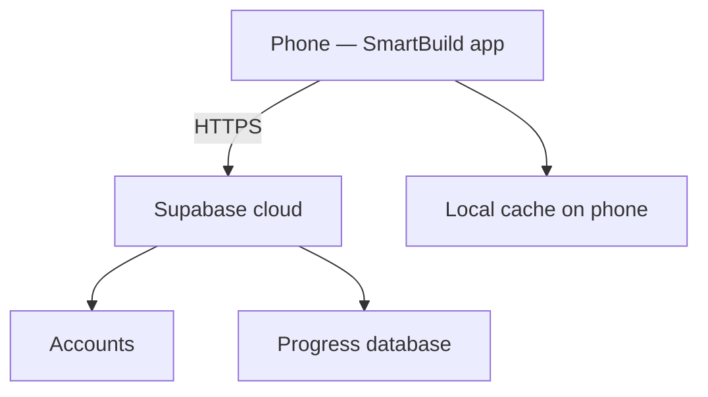

# SmartBuild — Backend (ano ang nangyayari)

**Para kanino:** clients / panelists na gusto maintindihan ang system, hindi yung code detail.  
**Related:** [SUPABASE.md](./SUPABASE.md) · [WORKFLOW.md](./WORKFLOW.md)

---

## Ano ang “backend” dito?

Ang **backend** = cloud services na hindi nakatira sa phone:

1. **Accounts** — sino ang student (email + password)  
2. **Progress** — ilang % ang module, tapos na ba ang Guided / Assessment  
3. **Sync** — kapag online, na-save sa cloud; kapag offline, naka-cache sa phone  

Walang custom server na hinahost ninyo sa VPS. Gumagamit ang app ng **Supabase** (Auth + database).

---

## Ano ang nangyayari, step by step

### 1. Bukas ng app
- Lumabas ang **Sign In / Sign Up**
- Wala pang session → hindi pa alam kung sino ang student

### 2. Mag-sign up / sign in
- Email + password → **Supabase Auth**
- Kapag successful → may **session** (token) sa app
- Redirect sa **Home**

### 3. Home
- App humihingi sa cloud: “ano ang progress nitong user?”
- Ipinapakita ang % sa bawat module card
- Puwedeng mag-Component Search (catalog sa app — hindi kailangan ng DB)

### 4. Magbukas ng module (Guided / Assessment)
- Student naglalaro / sumasagot sa simulation
- Progress **ina-update sa phone muna** (mabilis)
- Pagkatapos, **tinutulak sa cloud** (upsert)

### 5. Tapos ang Guided o Assessment
- Flag: `guided_done` o `assessment_done`
- Assessment → **100%**
- Bumalik sa Home → makikita ang bagong %

### 6. Sign out
- Session mawawala
- Susunod na login = **ibang account** = **ibang progress** (hindi maghalo)

---

## Dalawang layer ng data (importante)

| Layer | Saan | Bakit |
|-------|------|--------|
| **Local cache** | SharedPreferences sa phone | Mabilis UI; may offline |
| **Cloud** | Supabase table `module_progress` | Backup + sync sa ibang device / reinstall |

**Rule:** progress **hindi bumababa** (monotonic). Assessment lang ang puwedeng magdala sa 100%.

---

## Ano ang *hindi* backend

- Mga simulation screen (crimp, topology, Windows desktop, 3D bench) — **nasa app**
- Parts encyclopedia images — **nasa app**
- Module lessons content — **nasa app**

Backend = **identity + progress sync** lang.

---

## Simple mental model para sa defense

> “Yung app ang classroom. Yung Supabase ang **attendance / grade book** — sino ang student at hanggang saan na sila sa modules.”

Detalye ng table at SQL → **[SUPABASE.md](./SUPABASE.md)**  
Paano dumaloy ang learner → **[WORKFLOW.md](./WORKFLOW.md)**  
Play Store / bayad → **[PLAYSTORE.md](./PLAYSTORE.md)**  
