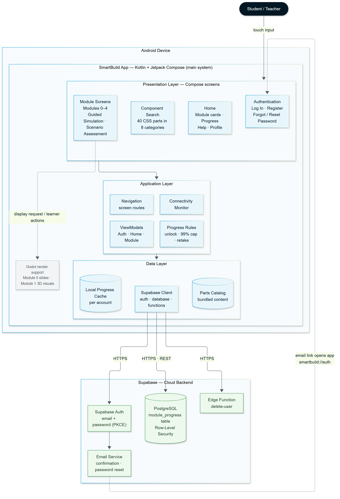
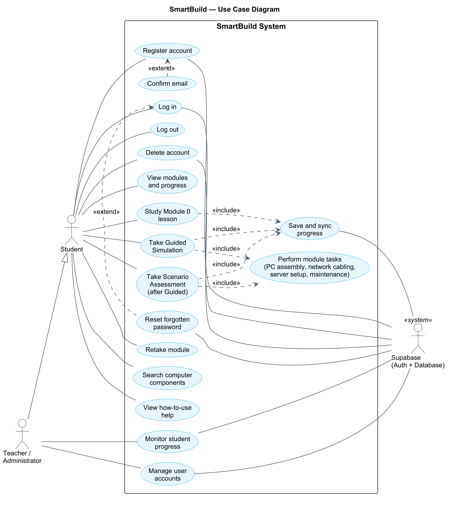
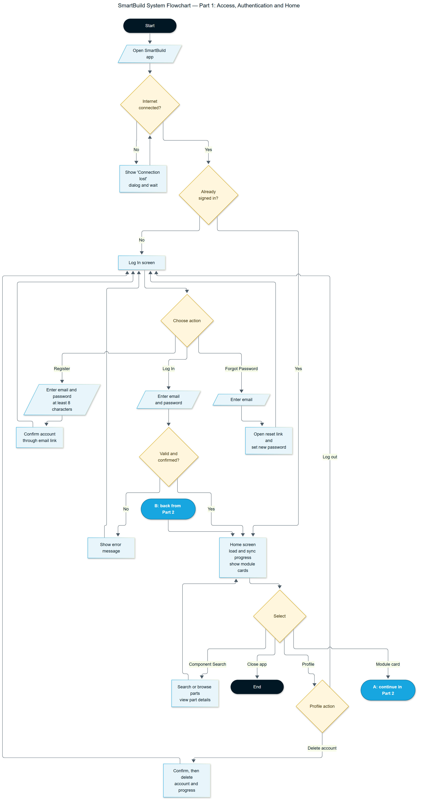
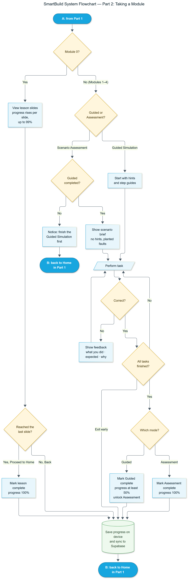

# SmartBuild — Diagrams

System diagrams for documentation, presentations and the thesis paper. Each diagram is
available as a high-resolution **PNG** (for documents) and **SVG** (scalable, for printing),
with its editable source file in [`diagrams/`](./diagrams/).

| Diagram | PNG | SVG | Source |
|---|---|---|---|
| System Architecture | [png](./diagrams/system-architecture.png) | [svg](./diagrams/system-architecture.svg) | `system-architecture.mmd` (Mermaid) |
| Use Case Diagram | [png](./diagrams/use-case.png) | [svg](./diagrams/use-case.svg) | `use-case.puml` (PlantUML) |
| System Flowchart — Part 1: Access, Authentication and Home | [png](./diagrams/system-flowchart.png) | [svg](./diagrams/system-flowchart.svg) | `system-flowchart.mmd` (Mermaid) |
| System Flowchart — Part 2: Taking a Module | [png](./diagrams/module-flowchart.png) | [svg](./diagrams/module-flowchart.svg) | `module-flowchart.mmd` (Mermaid) |

---

## 1. System Architecture



SmartBuild is an Android application built with **Kotlin and Jetpack Compose**, organised in
three layers:

- **Presentation layer** — the Compose screens the user sees: Authentication, Home, Component
  Search and the Module screens (Modules 0–4, Guided Simulation and Scenario Assessment).
- **Application layer** — ViewModels, screen navigation, the progress rules (Assessment
  unlocking, 99% cap before the Assessment, Retake) and the connectivity monitor.
- **Data layer** — the per-account local progress cache, the bundled parts catalog, and the
  Supabase client.

An embedded Godot component supports the Module screens by displaying the Module 0 slides and
the Module 1 3D visuals. The cloud backend is **Supabase**: Auth for accounts, a PostgreSQL
`module_progress` table protected by Row-Level Security, the `delete-user` Edge Function, and
the email service whose confirmation/reset links reopen the app through `smartbuild://auth`.

---

## 2. Use Case Diagram



| Actor | Description |
|---|---|
| **Student** | Primary user. Registers, logs in, studies the modules, takes Guided Simulations and Scenario Assessments, searches components, and manages their account |
| **Teacher / Administrator** | Can use every student feature (generalization), and additionally monitors student progress and manages user accounts through the Supabase dashboard |
| **Supabase** | External system that authenticates users and stores progress |

Relationships:

- **«extend»** — *Confirm email* extends *Register account* (when email confirmation is
  enabled); *Reset forgotten password* extends *Log in*.
- **«include»** — *Take Guided Simulation* and *Take Scenario Assessment* always include
  *Perform module tasks*; the lesson, Guided Simulation and Scenario Assessment all include
  *Save and sync progress*.
- *Take Scenario Assessment* is available only after the Guided Simulation of that module is
  completed.

---

## 3. System Flowchart

The flowchart is split into two parts. Connector **A** leads from Part 1 into Part 2, and
connector **B** returns from Part 2 to the Home screen in Part 1.

### Part 1 — Access, Authentication and Home



1. The app checks the internet connection; while offline it shows a blocking "Connection lost"
   dialog.
2. A signed-in user goes straight to Home. Otherwise the Log In screen offers **Log In**,
   **Register** (email confirmation) and **Forgot Password** (reset link).
3. Home loads and syncs progress, then the user opens Component Search, the Profile menu
   (Log out / Delete account), a module card (connector A), or closes the app.

### Part 2 — Taking a Module



1. **Module 0** is a lesson: progress rises per slide (up to 99%) and reaches 100% when the
   learner taps **Proceed to Home** on the last slide.
2. **Modules 1–4** offer the Guided Simulation (with hints) or the Scenario Assessment (scenario
   brief, no hints, planted faults). The Assessment is refused until the Guided Simulation is
   completed.
3. Each task is checked; a wrong action shows feedback (what you did, what was expected, why)
   and the learner tries again.
4. Finishing all tasks marks the Guided Simulation complete (at least 50%, unlocks the
   Assessment) or the Assessment complete (100%). Exiting early keeps the progress so far.
5. Progress is saved on the device and synced to Supabase, then the app returns to Home
   (connector B).

---

## 4. Editing and re-rendering

The diagrams are generated from the text sources in `docs/diagrams/`, so edits stay consistent
and reviewable. Edit the `.mmd` / `.puml` file, then re-render.

Tools used (installed outside the repository, in `tools/diagram-render/`):

- **Mermaid CLI** (`@mermaid-js/mermaid-cli`) rendered through Microsoft Edge
- **PlantUML** (`plantuml.jar`) running on the bundled JDK 17

One-time setup:

```powershell
cd D:\Porjects\Smartbuild\tools\diagram-render
$env:PUPPETEER_SKIP_DOWNLOAD = "true"
npm install @mermaid-js/mermaid-cli
# puppeteer.json: { "executablePath": "C:/Program Files (x86)/Microsoft/Edge/Application/msedge.exe", "args": ["--no-sandbox"] }
# force-font.css: * { font-family: Arial, Helvetica, sans-serif !important; }
# plantuml.jar:   download from https://github.com/plantuml/plantuml/releases
```

Render:

```powershell
cd D:\Porjects\Smartbuild\tools\diagram-render
$dd = "D:\Porjects\Smartbuild\docs\diagrams"

foreach ($n in "system-architecture", "system-flowchart", "module-flowchart") {
  npx mmdc -p puppeteer.json -C force-font.css -i "$dd\$n.mmd" -o "$dd\$n.png" -b white -s 3
  npx mmdc -p puppeteer.json -C force-font.css -i "$dd\$n.mmd" -o "$dd\$n.svg" -b white
}

$java = "D:\Porjects\Smartbuild\tools\jdk\jdk-17.0.20.1+1\bin\java.exe"
& $java -jar plantuml.jar -tpng -charset UTF-8 "$dd\use-case.puml"
& $java -jar plantuml.jar -tsvg -charset UTF-8 "$dd\use-case.puml"
```

Quick previews without installing anything: paste a `.mmd` file into
[mermaid.live](https://mermaid.live) or a `.puml` file into
[plantuml.com/plantuml](https://www.plantuml.com/plantuml).
