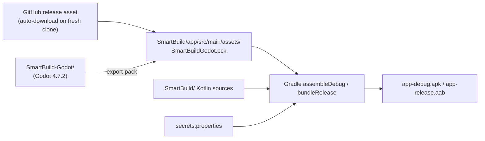

# SmartBuild — Setup and Build

How to get from a fresh Windows machine to an installable APK. For signed release builds see
[RELEASE](./RELEASE.md).

The product is the Compose Android app, built with Gradle. The supporting Godot content
(Module 0–1 visuals) is packed into one asset file that Gradle copies into the APK:

1. Get `SmartBuildGodot.pck`. On a fresh clone **the build downloads it automatically** from
   the GitHub release; you only export it yourself after changing the Godot content.
2. Build the Android app with Gradle.

**Quick start (fresh clone):** open `SmartBuild/` in Android Studio, create
`secrets.properties` (§3), then Run. The first build downloads the pack (~60 MB).



---

## 1. Prerequisites

| Tool | Version | Notes |
|---|---|---|
| Windows 10/11 | — | Scripts are PowerShell. macOS/Linux work with equivalent commands |
| Android Studio | A current release that supports AGP 9.2 | Provides the Android SDK and a JDK (`jbr`) |
| Android SDK Platform | API 37 (compileSdk 37.1) and build tools | Install from Android Studio → SDK Manager |
| JDK | 17 | Bundled in `tools/jdk/jdk-17.0.20.1+1/`. Android Studio's `jbr` also works |
| Godot editor | **4.7.2-stable** (standard, not .NET) | Bundled in `tools/godot/`. Must match — other versions may re-import assets differently |
| Git | Any | To clone / pull the two repositories |
| A physical Android phone | Android 7.0+ (API 24), ARM 64-bit or 32-bit | The APK contains only ARM native libraries — x86 emulators will not run it |

---

## 2. Get the source

```powershell
mkdir D:\Porjects\Smartbuild
cd D:\Porjects\Smartbuild
git clone https://github.com/KodeByKarl/SmartBuild.git
git clone https://github.com/KodeByKarl/SmartBuild-Godot.git
```

(Use the new owner's URLs if the repositories were transferred.)

The Android project expects the Godot project as a sibling folder only for the export script;
Gradle itself only needs the exported `.pck`.

---

## 3. Configure secrets

### Android (`SmartBuild/secrets.properties`)

Copy `secrets.properties.example` to `secrets.properties` and fill in:

```properties
SUPABASE_URL=https://<your-project-ref>.supabase.co
SUPABASE_ANON_KEY=<anon / publishable key from Supabase → Project Settings → API>
# Optional (defaults shown):
# SUPABASE_AUTH_SCHEME=smartbuild
# SUPABASE_AUTH_HOST=auth
```

- Environment variables with the same names override the file (useful for CI).
- These become `BuildConfig.SUPABASE_*`. If they are empty the build still succeeds (with a
  warning), but the app **crashes at start-up** because `SupabaseClient` requires them.
- Use the **anon** key only. Never the `service_role` key.

### Godot (`SmartBuild-Godot/config/env.local`) — optional

Only needed to run Godot **standalone in the editor**. On the phone, Godot receives the
session from the Android app. Copy `config/env.example` to `config/env.local`. Debug keys:

| Key | Purpose |
|---|---|
| `DEBUG_MOCK_SESSION=true` | Inject a fake signed-in session in the editor |
| `DEBUG_SHOW_MODULE_PICKER=true` | Show a Module 0 / Module 1 picker when running `Main.tscn` |
| `DEBUG_STANDALONE_MODULE_ID=1` | Open this module directly |
| `DEBUG_STANDALONE_SIMULATION_TYPE=0` | 0 Guided, 1 Assessment |

`env.local` is gitignored and excluded from the export.

### Machine-specific paths

| File | Setting | Change to |
|---|---|---|
| `SmartBuild/gradle.properties` | `org.gradle.java.home=D:\\Porjects\\Smartbuild\\tools\\jdk\\jdk-17.0.20.1+1` | Your JDK 17 path, or delete the line to use `JAVA_HOME` |
| `SmartBuild/local.properties` | `sdk.dir=...` | Your Android SDK path (Android Studio writes this automatically; the file is gitignored) |

---

## 4. Export the Godot pack

The `.pck` (~60 MB) is too large for the repository (it is gitignored), so the current pack
is published as an asset of the GitHub release
[v2.1](https://github.com/KodeByKarl/SmartBuild/releases/tag/v2.1).

**Fresh clone — nothing to do.** Before every build, the Gradle task `checkGodotPack` checks
`app/src/main/assets/SmartBuildGodot.pck`. If it is missing it downloads the release asset,
verifies its SHA-256, and continues. If there is no internet (or GitHub is blocked), download
the file manually from the release page into `app/src/main/assets/`.

**After changing the Godot content** you must export a new pack with one of the options
below. To make it the default for everyone who clones the repo:

1. Upload it to a new GitHub release (e.g. `gh release create v2.2 app\src\main\assets\SmartBuildGodot.pck`).
2. In `app/build.gradle.kts`, update `godotPackUrl` (new tag) and `godotPackSha256`
   (`(Get-FileHash app\src\main\assets\SmartBuildGodot.pck).Hash.ToLower()`).
3. Commit and push.

### Option A — script

```powershell
cd D:\Porjects\Smartbuild\SmartBuild-Godot
.\tools\export_android_pck.ps1
# or with an explicit editor path:
.\tools\export_android_pck.ps1 -GodotExe "D:\Porjects\Smartbuild\tools\godot\Godot_v4.7.2-stable_win64.exe"
```

The script looks for Godot in `GODOT_BIN`, then `D:\Porjects\Smartbuild\tools\godot\`, then a
few common paths.

> **Known issue:** in Windows PowerShell 5, harmless Godot warnings written to stderr can
> stop the script. If that happens, use option B.

### Option B — direct command

```powershell
& "D:\Porjects\Smartbuild\tools\godot\Godot_v4.7.2-stable_win64.exe" `
  --headless --path "D:\Porjects\Smartbuild\SmartBuild-Godot" `
  --export-pack Android "D:\Porjects\Smartbuild\SmartBuild\app\src\main\assets\SmartBuildGodot.pck"
```

A successful export produces a file of roughly **60 MB**. The export preset (`Android` in
`export_presets.cfg`) already excludes docs, tools, local secrets and unused models.

### Option C — Godot editor

Open the project in Godot 4.7.2 → **Project → Export…** → preset **Android** →
**Export PCK/ZIP…** → save as `SmartBuild/app/src/main/assets/SmartBuildGodot.pck`.

---

## 5. Build the Android app

### From Android Studio

1. **File → Open…** → `D:\Porjects\Smartbuild\SmartBuild`.
2. Let Gradle sync.
3. Select the `app` configuration and a connected phone → **Run**, or
   **Build → Build App Bundle(s) / APK(s) → Build APK(s)**.

### From the command line

```powershell
cd D:\Porjects\Smartbuild\SmartBuild
$env:JAVA_HOME = "D:\Porjects\Smartbuild\tools\jdk\jdk-17.0.20.1+1"   # or Android Studio\jbr
.\gradlew.bat :app:assembleDebug
```

Output: `SmartBuild\app\build\outputs\apk\debug\app-debug.apk` (about 146 MB). For the
official signed build (`assembleRelease`, about 132 MB) see [RELEASE](./RELEASE.md).

Useful tasks:

| Task | What it does |
|---|---|
| `:app:compileDebugKotlin` | Compile only (fast check) |
| `:app:assembleDebug` | Debug APK |
| `:app:installDebug` | Build and install on the connected phone |
| `:app:bundleRelease` | Release AAB (needs signing — see [RELEASE](./RELEASE.md)) |
| `:app:testDebugUnitTest` | JVM unit tests |
| `:app:connectedDebugAndroidTest` | Instrumented tests on a phone |
| `:app:checkGodotPack` | Downloads the `.pck` from the GitHub release if it is missing (runs automatically before every build) |

If Gradle says everything is `UP-TO-DATE` but the APK is missing, force packaging:
`.\gradlew.bat :app:packageDebug --rerun`.

---

## 6. Install on a phone

### USB (ADB)

1. On the phone: **Settings → About phone → tap Build number 7×** → **Developer options →
   USB debugging ON**.
2. Connect by USB and accept the prompt.
3. Install:

```powershell
& "$env:LOCALAPPDATA\Android\Sdk\platform-tools\adb.exe" install -r "D:\Porjects\Smartbuild\SmartBuild\app\build\outputs\apk\debug\app-debug.apk"
```

If you get `INSTALL_FAILED_UPDATE_INCOMPATIBLE`, the installed copy was signed with a
different key: uninstall it first (`adb uninstall com.smartbuild.app`).

### Sideload (no computer)

Copy the APK to the phone (Drive, USB, messaging app), open it, and allow
**Install unknown apps** for that source.

---

## 7. Tests and checks

### Android

| Test | File | Checks |
|---|---|---|
| `ExampleUnitTest` | `app/src/test/.../ExampleUnitTest.kt` | Template only |
| `P6SmokeInstrumentedTest` | `app/src/androidTest/.../P6SmokeInstrumentedTest.kt` | Progress rules (monotonic, 50% guided floor, 99% cap, 100% on assessment, retake) and route strings |

Instrumented tests need a phone, the `.pck`, and valid Supabase secrets.

### Godot (headless, from `SmartBuild-Godot/`)

```powershell
$g = "D:\Porjects\Smartbuild\tools\godot\Godot_v4.7.2-stable_win64.exe"
& $g --headless --path . --script res://tools/regress_probe.gd            # Module 1 full walk-through
& $g --headless --path . --script res://tools/progress_completion_probe.gd  # completion events
```

| Probe | Checks | Pass condition |
|---|---|---|
| `regress_probe.gd` | Walks every Module 1 page and drives each simulation (including the 3D bench) to completion | Report ends with `problems: 0` (exit code 0) |
| `progress_completion_probe.gd` | Exiting from the completion page sends exactly one of `guided_completed` / `assessment_completed` | No failures reported |
| `UiChangeProbe.tscn` | Module 0 chrome layout, assessment entry | **Outdated** — still tries to open Modules 2–4 |

`tools/run_ci.ps1` wraps `regress_probe.gd` and fails unless the report ends with `problems: 0`.
The regression report is written to
`%APPDATA%\Godot\app_userdata\SmartBuildGodot\regress_probe.txt`.

---

## 8. Everyday workflow

| You changed… | Do this |
|---|---|
| Kotlin / Compose code only | Build and run from Android Studio |
| Anything in `SmartBuild-Godot/` | Run the regression probe → export the `.pck` → rebuild the APK |
| `secrets.properties` | Rebuild (values are compiled into `BuildConfig`) |
| Supabase schema | Run the SQL, then reload the API schema in Supabase (see [SUPABASE](./SUPABASE.md)) |

Build problems: see [TROUBLESHOOTING](./TROUBLESHOOTING.md#1-build-problems).
