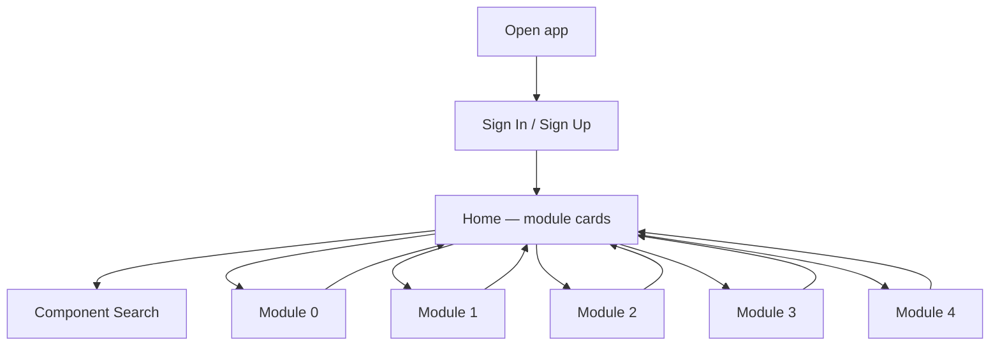
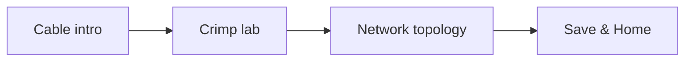
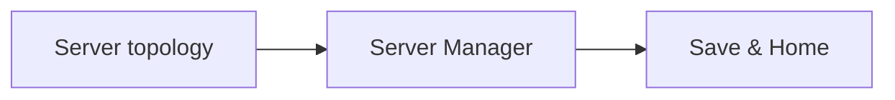

# SmartBuild — Learner workflow

**Para kanino:** panelists, clients, demo script.  
**Related:** [BACKEND.md](./BACKEND.md) · [ADJUSTMENTS.md](./ADJUSTMENTS.md)

---

## 1. App shell

1. Sign in → Home (progress % per module)  
2. Open **Guided Simulation** or **Scenario Assessment**  
3. Finish → progress saved (phone + cloud) → back to Home  
4. **Component Search** = CSS parts encyclopedia  

---

## 2. Two modes

| Mode | Behavior |
|------|----------|
| **Guided Simulation** | Yellow / DO THIS coaches; clean start |
| **Scenario Assessment** | Scenario brief first; often **faulted** start; **no** coach. Unlocks after Guided (or progress ≥ 99%). |

Module 0 = lesson only (no Scenario Assessment button).

---

## 3. Module 0 — Introduction

**Continue / Review Lesson** → multi-page intro slides → complete (100%).

---

## 4. Module 1 — Install & configure PC

**3D hardware bench** — disassemble then assemble (named bays: PSU, MB, CPU, cooler, RAM, storage, case cover…).

| Step | Action |
|------|--------|
| 1 | Open Guided (or Assessment when unlocked) |
| 2 | Drag parts to correct slots |
| 3 | Wrong slot → rule feedback |
| 4 | Guided done → Assessment unlocks |
| 5 | Assessment done → 100% |

---

## 5. Module 2 — Networks

| Station | What student does |
|---------|-------------------|
| 0 Cable intro | Straight-through vs crossover |
| 1 Crimp | Strip → pins 1–8 → crimp → LED test |
| 2 Topology | Place devices, cables, validate links |

**Assessment:** scenario brief; crimp forced straight-through; topology may start faulted.

---

## 6. Module 3 — Servers

| Station | What student does |
|---------|-------------------|
| 0 Topology | Packet Tracer–style grid; switch↔server = **straight-through** |
| 1 Server Manager | Roles, storage, groups, NTFS, share; prove ALLOW/DENY |

**Assessment:** wrong cable / incomplete ACL style faults.

---

## 7. Module 4 — Maintenance

Full-screen **Windows desktop** service visit:

1. Accept ticket  
2. Drag wallpaper onto desktop  
3. Junk → Recycle Bin  
4. Disk Cleanup  
5. **CMD — type** `ping 192.168.1.1` then `ping 8.8.8.8`  
6. Action Center → close ticket → Finish  

**Guided:** floating DO THIS guide.  
**Assessment:** scenario brief; ticket already open / warnings to clear.

---

## 8. Recommended demo path

1. Sign up / in  
2. Module 0 skim  
3. Module 1 Guided (3D)  
4. Module 2 Guided (crimp + topology)  
5. Module 3 Guided (topology + Server Manager)  
6. Module 4 Guided (Windows + typed ping)  
7. One Scenario Assessment sample  
8. Component Search one part  

---

## 9. Unlock rules (Assessment)

| Condition | Result |
|-----------|--------|
| Guided finished | Assessment enabled |
| Progress ≥ 99% but flag missing | Treated as Guided done |
| Tap Assessment too early | Toast — finish Guided first |
